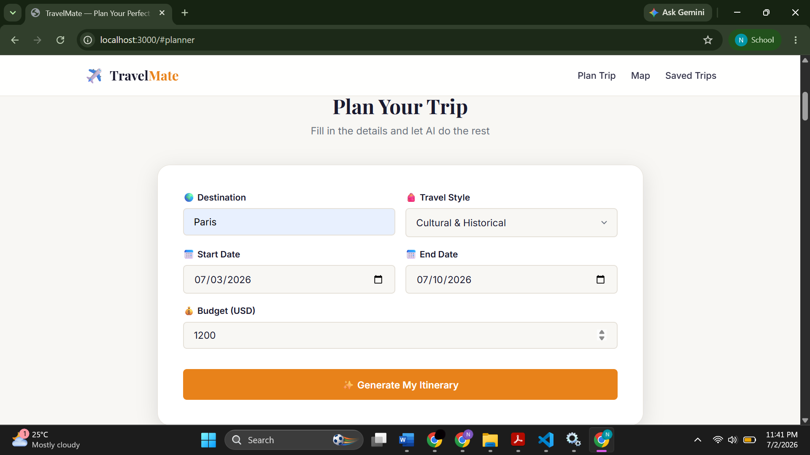
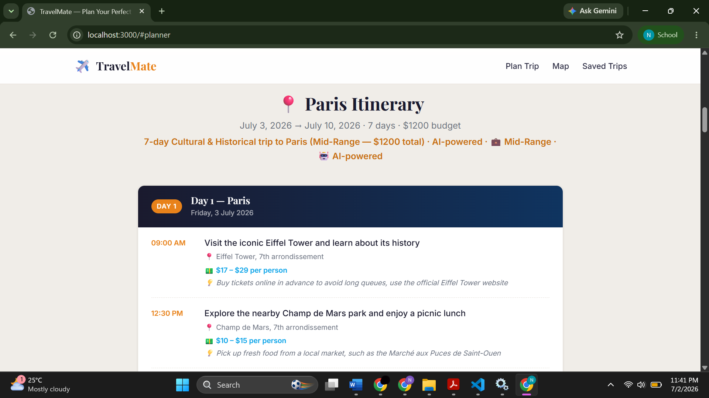
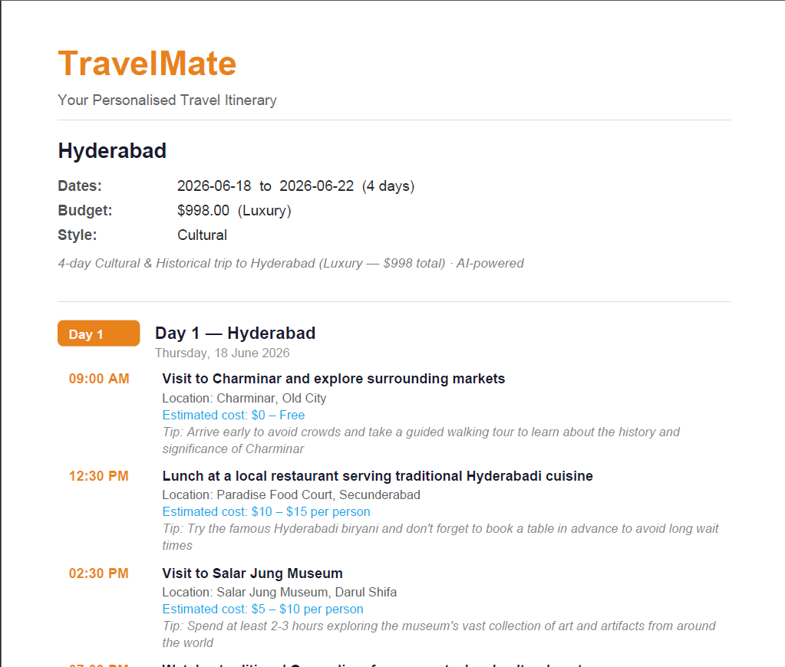

# TravelMate 🧳

TravelMate is a full-stack travel planning application that generates personalized itineraries based on destination, budget, travel style, and trip duration — combining AI-powered generation with a rule-based fallback engine for reliability.

🔗 **Repo:** https://github.com/Nagalakshmi-Murugan/TravelMate

---

## Demo


## Screenshots:


| Trip Input Form | Generated Itinerary | PDF Export |
|  |  |  |


---

## Features

- AI-powered itinerary generation (Groq API, Llama 3.3 70B)
- Rule-based fallback engine (used automatically if the AI service is unavailable)
- Personalized trip planning by destination, budget, travel style, and duration
- Interactive multi-location maps (Leaflet.js + OpenStreetMap tiles) with day-coloured markers, popups, and auto-fit bounds
- Destination and per-attraction geocoding via Nominatim (rate-limited to respect its usage policy)
- Save trips to a MySQL database, view trip history, delete saved trips
- PDF itinerary export
- REST API architecture with an Express backend
- Responsive UI

## Tech Stack

| Layer | Technology |
|---|---|
| Frontend | HTML5, CSS3, JavaScript |
| Backend | Node.js, Express.js |
| Database | MySQL |
| Other | PDF generation library, AI API integration, dotenv, cors |

## Architecture

```
User Interface
       │
       ▼
Express Backend
       │
       ├──────────────┬──────────────┐
       ▼              ▼
AI Itinerary     Rule-Based
    Engine          Engine
       │
       ▼
MySQL Database
       │
       ├──────────────┐
       ▼              ▼
   PDF Export    Leaflet Map
                  (Nominatim
                  geocoding)
```

## How It Works

1. User enters destination, travel dates, budget, and travel style.
2. The request is sent to the Express backend.
3. The backend attempts to generate an itinerary via the AI service (Groq LLM API).
4. If the AI service is unavailable, the app automatically falls back to the rule-based itinerary engine.
5. The itinerary is displayed to the user, along with an interactive map (Leaflet.js) that geocodes each attraction via Nominatim and drops day-coloured markers.
6. Users can save the trip, view saved trips, delete trips, or export the itinerary as a PDF.

---

## Getting Started

### Prerequisites
- Node.js (v18+ recommended)
- MySQL (v8+ recommended)
- An API key for the AI provider used (Groq)

### 1. Clone the repo
```bash
git clone https://github.com/Nagalakshmi-Murugan/TravelMate.git
cd TravelMate
```

### 2. Install dependencies
```bash
npm install
```

### 3. Configure environment variables
Create a `.env` file in the project root:
```env
PORT=3000

# AI Provider Key
API_KEY=your_api_key_here

# MySQL Database
DB_HOST=localhost
DB_USER=root
DB_PASSWORD=your_password
DB_NAME=travelmate
```

### 4. Set up the database
```sql
CREATE TABLE trips (
    id INT AUTO_INCREMENT PRIMARY KEY,
    destination VARCHAR(100),
    budget VARCHAR(50),
    style VARCHAR(50),
    start_date DATE,
    end_date DATE,
    itinerary LONGTEXT,
    created_at TIMESTAMP DEFAULT CURRENT_TIMESTAMP
);
```

### 5. Start the server
```bash
npm start
# or
node server.js
```

Visit `http://localhost:3000` in your browser.

---

## Project Structure

```
TravelMate/
├── backend/       # Express server, routes, controllers, DB logic
├── database/       # Schema / DB setup files
├── frontend/       # HTML, CSS, JS client
├── .gitignore
└── README.md
```

---

## Future Enhancements

- Trip sharing functionality
- User authentication
- Trip favorites
- Calendar integration
- Multi-destination trip planning

## Learning Outcomes

Building this project involved:
- Full-stack web development and REST API design
- Node.js and Express fundamentals
- MySQL integration and CRUD operations
- Environment variable management
- PDF generation
- AI API integration with a fallback strategy
- Git and GitHub workflows

## Author

**Nagalakshmi**
📧 n4772754@gmail.com | 🔗 [GitHub](https://github.com/Nagalakshmi-Murugan)