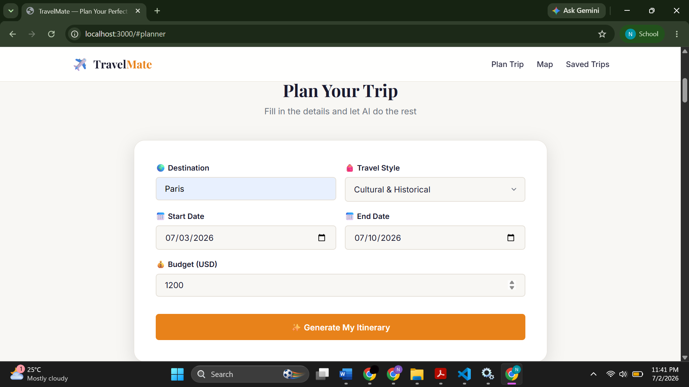
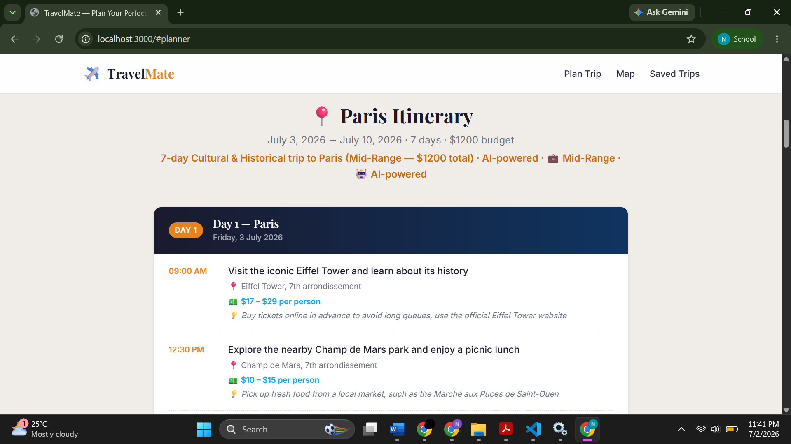
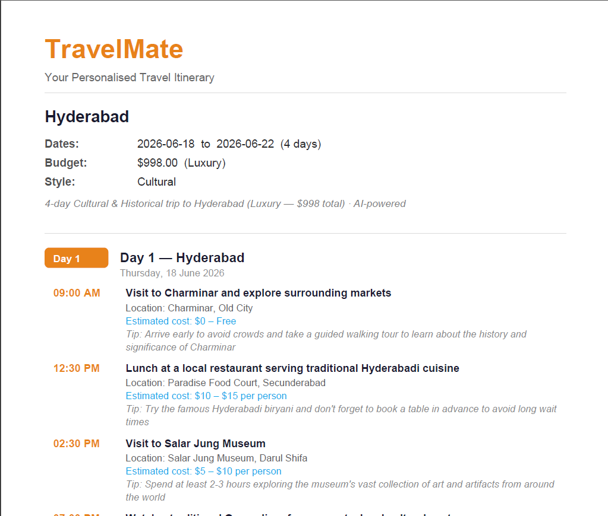

# TravelMate 🧳

TravelMate is a full-stack travel planning application that generates personalized itineraries based on destination, budget, travel style, and trip duration — combining AI-powered generation with a rule-based fallback engine for reliability.

🔗 **Repo:** https://github.com/Nagalakshmi-Murugan/TravelMate

---

## Demo

## with login

 

## Screenshots:

| Trip Input Form | Generated Itinerary | PDF Export |
|  |  |  |

---

## Features

AI-powered itinerary generation (Groq API — see AI model below)
Rule-based fallback engine (used automatically if the AI service is unavailable)
Personalized trip planning by destination, budget, travel style, and duration
Interactive multi-location maps (Leaflet.js + OpenStreetMap tiles) with day-coloured markers, popups, and auto-fit bounds
Destination-aware, country-validated geocoding via Nominatim — every attraction is geocoded with the trip destination as context and checked against the destination's country before becoming a marker, so ambiguous names (e.g. a generic venue name that also exists elsewhere in the world) can't land in the wrong country. Locations that can't be reliably resolved are skipped rather than placed incorrectly
Sequential, rate-limit-compliant geocoding that respects Nominatim's usage policy, so large itineraries (20+ attractions) load reliably instead of triggering throttling
User authentication (registration, login, sessions) — each user has their own account and can only view/manage their own saved trips
Save trips to a MySQL database, view trip history, delete saved trips
PDF itinerary export
REST API architecture with an Express backend
Responsive UI
AI Model

The AI itinerary generation runs on Groq's free tier. The active model is configurable via the GROQ_MODEL environment variable (defaults to qwen/qwen3.6-27b) rather than hardcoded, so it can be swapped without touching source code — this became necessary after Groq deprecated the previously-used llama-3.3-70b-versatile model. If the AI request fails for any reason (model unavailable, rate limit, malformed response), the app automatically falls back to the rule-based itinerary engine, so trip generation never breaks entirely.

Tech Stack
Layer	Technology
Frontend	HTML5, CSS3, JavaScript
Backend	Node.js, Express.js
Database	MySQL
Other	PDF generation library, AI API integration, dotenv, cors
Architecture
User Interface
       │
       ▼
Express Backend
       │
       ├──────────────┬──────────────┐
       ▼              ▼
AI Itinerary     Rule-Based
    Engine          Engine
       │
       ▼
MySQL Database
       │
       ├──────────────┐
       ▼              ▼
   PDF Export    Leaflet Map
                  (Nominatim
                  geocoding)
How It Works
User logs in (or registers) to access their own trip planner.
User enters destination, travel dates, budget, and travel style.
The request is sent to the Express backend.
The backend attempts to generate an itinerary via the AI service (Groq LLM API).
If the AI service is unavailable, the app automatically falls back to the rule-based itinerary engine.
The itinerary is displayed to the user, along with an interactive map (Leaflet.js). Each attraction is geocoded via Nominatim using the trip destination as context, validated against the destination's country, and dropped as a day-coloured marker — attractions that can't be reliably located are skipped rather than mismarked.
Users can save the trip, view saved trips, delete trips, or export the itinerary as a PDF — each scoped to their own account.
Getting Started
Prerequisites
Node.js (v18+ recommended)
MySQL (v8+ recommended)
An API key for the AI provider used (Groq) — free tier is sufficient, see .env.example
1. Clone the repo
bash
git clone https://github.com/Nagalakshmi-Murugan/TravelMate.git
cd TravelMate
2. Install dependencies
bash
npm install
3. Configure environment variables

Copy .env.example to .env in the project root and fill in your values:

bash
cp .env.example .env
env
PORT=3000

# AI Provider Key (Groq — free tier: https://console.groq.com/keys)
GROQ_API_KEY=your_groq_api_key_here

# Optional — overrides the default AI model without touching source code
GROQ_MODEL=qwen/qwen3.6-27b

# MySQL Database
DB_HOST=localhost
DB_USER=root
DB_PASSWORD=your_password
DB_NAME=travelmate

SESSION_SECRET=change_this_to_a_long_random_string
4. Set up the database

Run the schema file, which creates both the users and trips tables:

bash
mysql -u root -p < database/schema.sql

Or create the tables manually in this order (users must exist before trips, since trips.user_id is a foreign key referencing it):

sql
CREATE DATABASE IF NOT EXISTS travelmate;
USE travelmate;

CREATE TABLE IF NOT EXISTS users (
  id          INT AUTO_INCREMENT PRIMARY KEY,
  name        VARCHAR(100)  NOT NULL,
  email       VARCHAR(255)  NOT NULL UNIQUE,
  password    VARCHAR(255)  NOT NULL,
  created_at  TIMESTAMP     DEFAULT CURRENT_TIMESTAMP
);

CREATE TABLE IF NOT EXISTS trips (
  id          INT AUTO_INCREMENT PRIMARY KEY,
  user_id     INT           NOT NULL,
  destination VARCHAR(255)  NOT NULL,
  start_date  DATE          NOT NULL,
  end_date    DATE          NOT NULL,
  budget      DECIMAL(10,2) NOT NULL,
  style       VARCHAR(50)   NOT NULL,
  days        INT           NOT NULL,
  summary     VARCHAR(255),
  budget_tier VARCHAR(20),
  itinerary   JSON          NOT NULL,
  created_at  TIMESTAMP     DEFAULT CURRENT_TIMESTAMP,
  FOREIGN KEY (user_id) REFERENCES users(id) ON DELETE CASCADE
);
users.email is UNIQUE — duplicate signups are rejected at the database level
users.password stores a bcrypt hash, never the plaintext password
trips.user_id references users.id with ON DELETE CASCADE, so deleting a user also deletes their saved trips
trips.itinerary is a native JSON column holding the full day-by-day itinerary array
5. Start the server
bash
npm start
# or
node server.js

Visit http://localhost:3000 in your browser.

Project Structure
TravelMate/
├── backend/       # Express server, routes, controllers, DB logic
├── database/       # Schema / DB setup files
├── frontend/       # HTML, CSS, JS client
├── .env.example
├── .gitignore
└── README.md
Future Enhancements
Trip sharing functionality
Trip favorites
Calendar integration
Multi-destination trip planning
Learning Outcomes

Building this project involved:

Full-stack web development and REST API design
Node.js and Express fundamentals
MySQL integration and CRUD operations
User authentication and session management
Environment variable management
PDF generation
AI API integration with a fallback strategy, including migrating a live integration to a new provider-recommended model ahead of a deprecation deadline
Debugging cross-layer issues — including a case-sensitive module-resolution bug that only surfaced on Linux hosts, and a geocoding regression that traced back to violating a third-party API's rate-limit policy
Designing destination-aware, validated geocoding logic to keep map data accurate for arbitrary destinations worldwide
Git and GitHub workflows
Author

Nagalakshmi 📧 n4772754@gmail.com | 🔗 GitHub